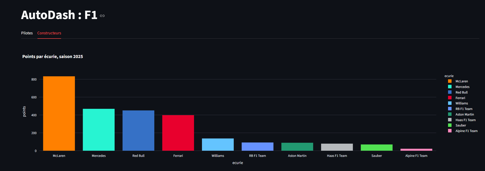

# AutoDash

Tableau de bord des statistiques du sport automobile, par saison et par course, avec simulation des dernières manches d'un championnat encore ouvert.

> Statut : en développement. Pour l'instant, seule la Formule 1 est couverte. MotoGP, WRC, Formule E et WEC sont prévus.



## Fonctionnalités

- Sélecteur de saison, de 1950 à aujourd'hui
- Classement pilotes : tous les points de la saison, avec l'écurie actuelle du pilote
- Classement constructeurs : les points de chaque course vont à l'écurie attitrée
- Courses sprint incluses
- Couleurs officielles des écuries
- Cache des appels API (1 heure)

## Stack

Python 3.13, Streamlit, Plotly, pandas, requests.
Données : [API Jolpica-F1](https://api.jolpi.ca/) (successeur d'Ergast).

## Installation

### Windows (PowerShell)

```powershell
git clone https://github.com/Nixy00/AutoDash.git
cd AutoDash
py -m venv venv
.\venv\Scripts\Activate.ps1
pip install -r requirements.txt
py -m streamlit run app.py
```

### Linux / macOS

```bash
git clone https://github.com/Nixy00/AutoDash.git
cd AutoDash
python3 -m venv venv
source venv/bin/activate
pip install -r requirements.txt
python3 -m streamlit run app.py
```

L'application est ensuite disponible sur http://localhost:8501.

## Structure du projet

```
AutoDash/
├── app.py                  # interface Streamlit
├── requirements.txt
└── src/
    ├── ingestion/
    │   └── f1_api.py       # récupération des données (API, pagination)
    └── analysis/
        └── classements.py  # calcul des classements
```

Principe : `ingestion` récupère, `analysis` calcule, `app.py` affiche.
Aucun de ces modules n'est mélangé avec les autres.

## Choix de calcul

- **Classement pilotes** : somme de tous les points du pilote sur la saison, y compris les sprints. L'écurie affichée est celle de sa dernière manche.
- **Classement constructeurs** : chaque résultat rapporte ses points à l'écurie pour laquelle le pilote roulait ce jour-là. Un pilote qui change d'équipe en cours d'année répartit donc ses points entre les deux.
- **Avant 1958** : pas de championnat constructeurs, l'onglet est désactivé.
- **Années 1950** : des pilotes partageaient parfois une voiture et les points étaient répartis, donc les totaux sont moins fiables.
- **Données anciennes** : certains champs peuvent être absents, le code les gère sans planter.

## Vérification

Les totaux du classement constructeurs, calculés course par course (sprints inclus), ont été comparés à ceux de l'endpoint officiel `/constructorstandings/` de l'API Jolpica pour les saisons 2025, 2010 et 1990. Les résultats concordent.

Pour refaire la vérification : ouvrir `https://api.jolpi.ca/ergast/f1/<saison>/constructorstandings/` et comparer avec l'onglet « Constructeurs » du dashboard.
## Feuille de route

- [ ] Fiche pilote (évolution des points course par course)
- [ ] Simulation de fin de championnat
- [ ] Gestion de la saison en cours
- [ ] Docker et docker-compose
- [ ] Stockage en base PostgreSQL
- [ ] Autres disciplines : MotoGP, WRC, Formule E, WEC
- [ ] Version React + FastAPI

## Sécurité

- Validation de la saison avant tout appel API
- Timeout sur les requêtes HTTP
- Aucun secret dans le dépôt (`.env` ignoré par Git)

## Licence et données

Projet personnel réalisé pour mon portfolio. Les données appartiennent à leurs sources respectives.